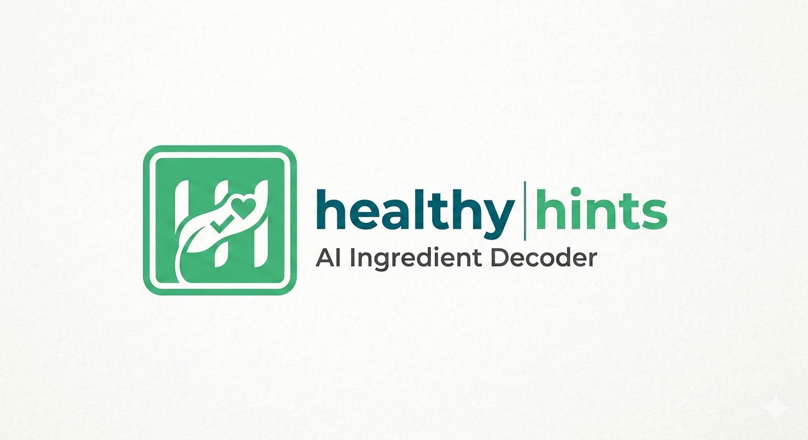
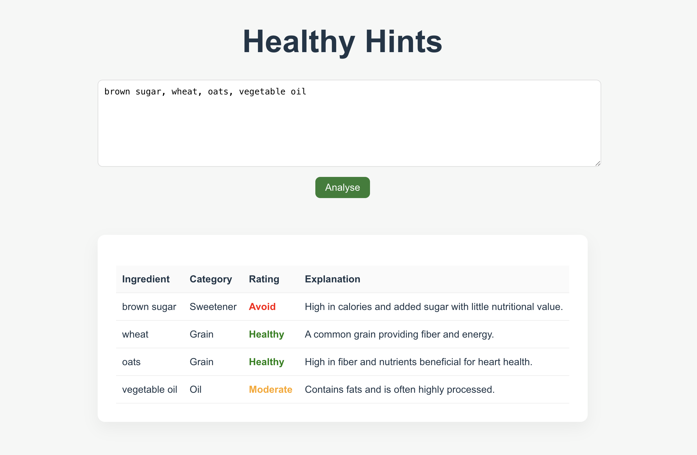

<p aign="center">
  
</p>
<h1 align="center">Healthy Hints</h1>
<p align="center">
  Understand what's really inside your products.
</p>

Healthy Hints is an open-source AI tool that decodes complex ingredient labels into simple, understandable insights.
Healthy Hints focuses on helping people understand what’s actually inside packaged products — food, cosmetics, candles, supplements, and more.

## Demo

<p align="center">
  
</p>

## Features

- Ingredient text analysis
- Gemini-powered classification
- Health rating (Healthy/Moderate/Avoid)
- Short explanation per ingredient

## Vision

We believe people deserve transparency in the products they consume, apply, or inhale.

Ingredient labels are often filled with complex chemical names and unfamiliar terminology. Healthy Hints aims to make those labels readable, approachable, and understandable for everyone.

Our long-term vision is to become a community-driven transparency engine for all packaged consumables — from food and skincare to home fragrance and wellness products.

In the future, Healthy Hints could integrate with:

- Smart devices
- Grocery platforms
- Wearables
- E-commerce systems

## Tech Stack
Backend:
  - Python
  - FastAPI
  - Gemini API

Frontend:
  - React
  - Typescript
  - Vite

## Project Structure

- api/ → FastAPI API
- web/ → Vite UI

## How to Run Locally

- Clone Repo
```bash
git clone https://github.com/bajajneha27/healthy-hints.git
cd healthy-hints
```

- Backend

```bash
cd api
python -m venv .venv
source .venv/bin/activate
pip install -r requirements.txt
```

Create `.env` file:
```bash
GEMINI_API_KEY=your_key_here
```

Start Server:
```bash
uvicorn main:app --reload --port 8080
```

- Frontend

```bash
cd web
npm install
npm run dev
```

Open:
```bash
http://localhost:5173
```

## Example Request

```bash
curl --request POST \
  --url http://127.0.0.1:8080/analyse \
  --header 'Content-Type: application/json' \
  --data '{"ingredients_text": "Sugar, Palm Oil, Salt}'
```

Expected Response:
```json
[
  {
    "name": "Sugar",
    "category": "Sweetener",
    "health_rating": "Avoid",
    "explanation": "High glycemic impact."
  }
]
```

## ⚠️ Disclaimer

Healthy Hints provides ingredients analysis for informational purpose only.
The health ratings and explanations are generated using AI models. They are not
medical advice and should not be used to diagnose or treat any medical condition.

## License

MIT License